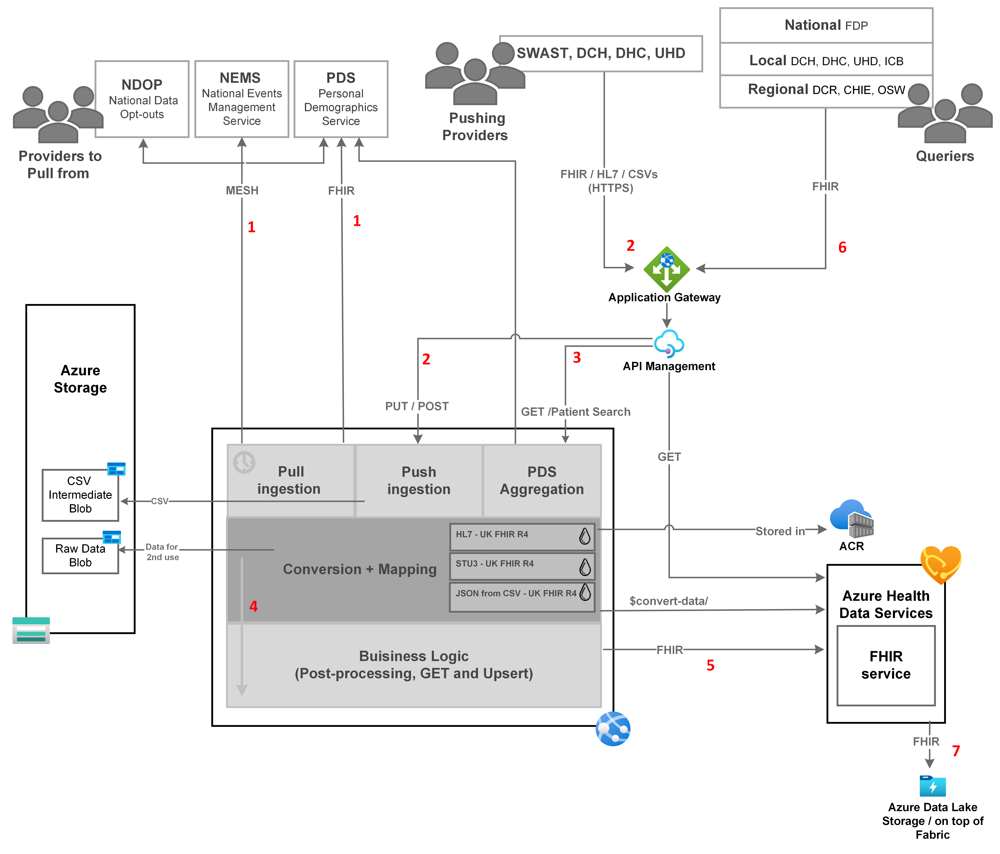

# Architecture

This document is an evolving description and diagram of the Healthcare Data Exchange Architecture.

## Data flow

Healthcare Data Exchange integrates with multiple consumers, who query data from it. It also integrates with providers, who update the data within it.
The data from the providers sources can be either pushed to the platform, or pulled from the sources, it can be in multiple formats.
The data then is normalised, going through conversions and mappings, to be transformed into a unified FHIR format, that is persisted in the platform into a FHIR service.
This format is the format in which data is queried from the platform by its consumers, some client applications like an ED management system.
To orchestrate pushing, pulling, and transforming the incoming data, Healthcare Data Exchange holds a component that acts as a facade for the FHIR service.

1. Data is ingested into the platform, by the facade, by pulling from the sources, e.g. reading a message from a MESH mailbox, or with RESTful API calls.
1. Data is pushed to the platform, to the facade, by accepting REST HTTP requests, in FHIR or HL7 formats, or streaming CSV / files in the request body. In case a source is not able to push files in HTTP requests, an 'agent' application might be deployed on the client side, that will push the data to the platform.
1. Ingesting patients into the system might also be triggered by GET requests for patient search, in turn triggering update / creation of new patients based on PDS (the main NHS patient index).
1. The ingested data flows in the facade, between several components.
    - A conversion component converts the data into FHIR R4, a mapping component maps the FHIR R4 into a unified FHIR that aligns all attributes, and maps them to FHIR UK Core profile.
    - Conversion and mapping would use (liquid) templates which will be used by the Azure Health FHIR services (REST $convert-data API call).
    - The template are pushed during application deployment, as OCI artifacts to Azure Container Registry.
    - Those templates are meant to be easy to write for a Healthcare Data Exchange integrator.
    - In case needed, the data in its raw form will be written, before conversion, into a blob storage, for secondary use purposes.
    - A final component might hold business logic that is required post-conversion, and before persisting the records, like upserting, updating references between existing FHIR records, or any other post-processing operations.
1. Data is persisted into a managed 'Azure Health Data Services' FHIR service.
1. Queriers get data from the platform by GET requests, routed into the FHIR service by an Azure Api Management service.
1. At known intervals, data is propagated into a Data lake for secondary use, taking into consideration the patients data opt-out preferences. It can later be queried in FHIR/OMOP formats for analytics / data science purposes.

## Azure and networking

Healthcare Data Exchange is meant to be deployed as a solution over the Azure cloud.

1. Application gateway will receive all incoming REST HTTPS requests acting as the system entrypoint. It will also act as a load balancer, and have the Web Application Firewall (WAF) enabled. It will be deployed under a dedicated subnet, and will be the only component exposed to the internet.
1. API Management will enforce Authentication and Authorization, integrating with Microsoft Entra ID to validate the JWT tokens based on Application Roles. It will route requests based on their verb and resource to either the Facade or directly to the FHIR service. It will be deployed under a dedicated subnet, and linked as a single 'backend pool' to the Application Gateway.
1. The FHIR Facade will be deployed in an Azure Web App Service, under an App Service Plan, holding all components described in the Data flow section, deployed under a subnet with virtual network integration.
1. The FHIR service will be provisioned as the managed FHIR service that is part of the Azure Health Data Services.
1. Azure storage will hold the blob storages that will be used for intermediate persistence.
1. Application insights and log analytics managed services will provide insights and observations on the whole platform.
1. Azure container registry (ACR) will hold artifacts like docker images, from which the services will be deployed, and the liquid templates for conversion and mappings (to be consumed by the FHIR service).
1. Azure Key vault will hold secrets and certificates and configurations, that will be used by the platform.
1. Azure data lake will hold data for secondary use, and later, might be migrated into an Azure Fabric managed offering.
1. All subnets will be part of a single core VNET.
1. All SaaS offerings / resources that are not in the core VNET, will be linked to the VNET with private links when possible.

