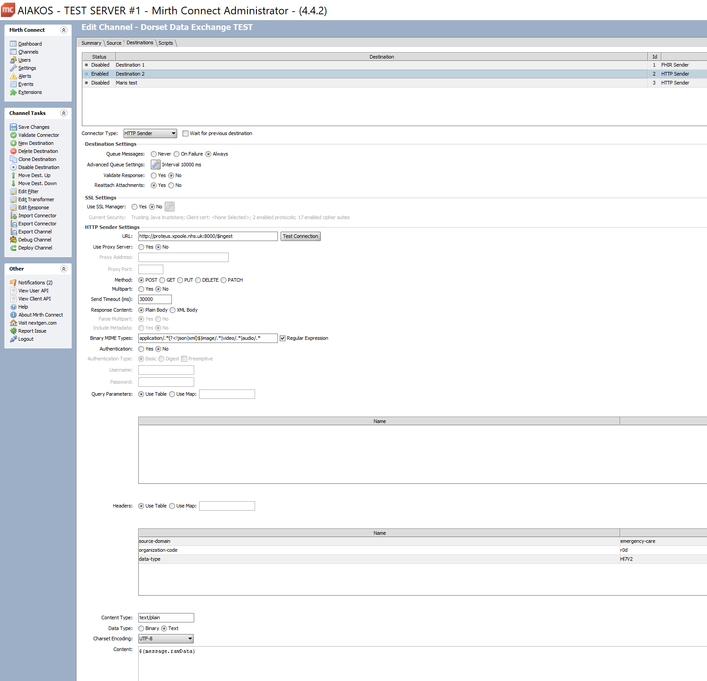
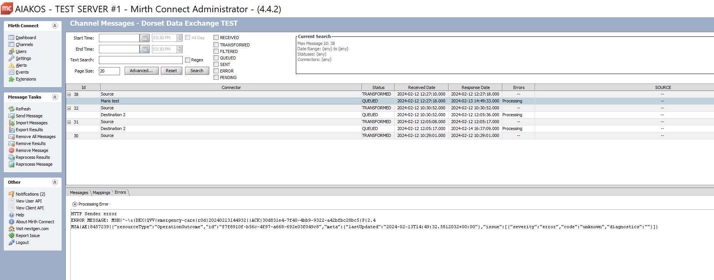

# Integration Guide

## Connecting to Healthcare Exchange

Healthcare Exchange supports receiving HL7 2.x, HL7 FHIR, and CSV messages via the HTTPS transport protocol.

Healthcare Exchange does not support sending HL7 messages directly to a TCP port.

MLLP is not used. The HL7 message is sent in plaintext and should not be encoded.

The $ingest endpoint is:

{agreed FQDN}{:agreed port}/$ingest

Development environment:

http://localhost:8000/$ingest

Production:

https://{FQDN}/$ingest

### Authentication (TBD)

Mutual TLS should be used to guarantee the security and authenticity of both the client (receiving integration engine) and the server (Healthcare Exchange). Certificates will need to be exchanged in advance and deployed using the relevant tool for your environment, typically this is keytool for an integration based on a java virtual machine (JVM) or by adding to the windows certificate store.

Messages are sent in plaintext and are not encoded or encrypted, instead the underlying connection is encrypted and considered to be secure providing mutual TLS is enabled.

Authentication is achieved using OAuth2.  The OAuth endpoint will be provided through API management.

[What is OAuth2?](https://stackoverflow.blog/2022/12/22/the-complete-guide-to-protecting-your-apis-with-oauth2)

How do I implement OAuth2 in my integration engine flow:

[Channel based method (Mirth)](./integration-guide.md)

[JWT (Mirth)](./integration-guide.md)

The **Service Principal** will be issued upon successful authentication with the $ingest/auth service (*TBD). The **Service Principal** is the token which is used for successive requests to the $ingest service.

### Authorisation

The **Service Principal** must be [registered](https://learn.microsoft.com/en-us/entra/identity-platform/howto-create-service-principal-portal#register-an-application-with-microsoft-entra-id-and-create-a-service-principal) before the $ingest endpoint can be used. The following [roles/permissions](https://learn.microsoft.com/en-us/entra/identity-platform/howto-create-service-principal-portal#assign-a-role-to-the-application) must be allocated to the **Service Principal**

*Connect as organisation

Send as organisation

Send message category*

## The $ingest request

The following variables must be configured to be sent in the HTTP header:

source-domain example: emergency-care

organisation-code example: r0d

data-type example: Hl7v2

The capitalisation of the data-type must match **Hl7v2** exactly

The source-domain must exist within Healthcare Exchange, here we specify the **emergency-care** source-domain.

Organisation codes match those provided by [ODS](https://odsportal.digital.nhs.uk/Organisation/Search).

The data-type parameter specifies the message type being passed.

A **Content-Type** of text/plain is required. The **charset** option is not required, but if used should be set to **utf-8**.

The following example demonstrates setting up an integration flow using Mirth, but the same principles should apply to any other integration engine.

## Viewing logs

Running docker containers:

docker ps -a

Output the tail of the log:

docker logs --follow

## Deploying the channel

(Mirth)

In the dashboard view, use filter to find your channel

Right click, choose undeploy channel

Return to the channels view, use filter to find your channel

Right click, choose deploy

## Sending a message

(Mirth)

In the dashboard view, double click on the channel

Right click on the message pane

Click **Send Message**

Paste a HL7 message into the edit control, or generate a suitable message using the generator

Click **Process Message**

## Viewing the response

In the dashboard view

Click on **raw** or **encoded** to see the message

Click on **sent** to see the message and HTTP headers sent

Click on **response** to view the response

MSH|^~\&|DEX|QVV|emergency-care|r0d|20240213144932||ACK|30d831e4-7f40-4bb9-9322-a42bfbc28bc5|P|2.4

MSA|AE|8457239|{"resourceType":"OperationOutcome","id":"f7f8910f-b56c-4f97-a668-692e03f049c8","meta":{"lastUpdated":"2024-02-13T14:49:32.5812032+00:00"},"issue":[{"severity":"error","code":"unknown","diagnostics":""}]}

## Using FHIR to check/retrieve the stored resource

The api documentation can be accessed using swagger.  Swagger exposes all direct interfaces and those proxied through the facade to the FHIR server.  These interfaces can be used directly via swagger.

https://{agreed FQDN}/swagger/index.html

The following FHIR query should return the stored resource:

Production:

https://{agreed FQDN}/Patient?_id=0000000000
