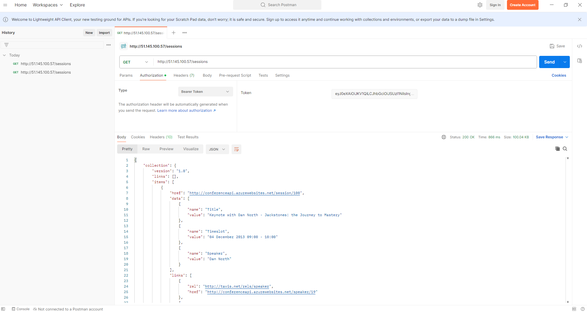

# Testing the service on the cloud

In order to make a request to the service (on cloud), you will need to perform the following steps.

## Pre requirements

- A member of the subscription which you will use to host the Dex.
- The Dex solution deployed to the above Azure subscription.
- Azure CLI (You can install the [Azure CLI](https://learn.microsoft.com/en-us/cli/azure/install-azure-cli))

## 1. Allow your IP

Application Gateway is the entrypoint to the service and is configured with a Web Application Firewall (WAF).\
This WAF has a policy which allows certain IPs and blocks all others.\
If you try to make a request to the public IP of Application Gateway without allowing your IP, then you will receive a `403 Forbidden` response.
Use the script [setup-dev-to-infra-access.sh](./scripts/setup-dev-to-infra-access.sh) to allow your IP to access the Application Gateway and the [scm (kudo) site](https://learn.microsoft.com/en-us/azure/app-service/resources-kudu) for the web app.

```cli
# Setup environment variables
export CLIENT_ID=<client (service principle) id>
export SUBSCRIPTION_ID=<subscription id>
export TENANT_ID=<tenant id>
export CLIENT_SECRET=<client (service principle) secret>
export env=<dev/staging/production>

sh ./scripts/setup-dev-to-infra-access.sh
```

If you prefer to do it manually, follow the steps below:\
 **Make sure you're logged-in to the Azure subscription which you will use to host Dex.**

- Go to [Application Gateway](https://portal.azure.com/#view/Microsoft_Azure_Network/LoadBalancingHubMenuBlade/~/applicationgateways) (`agw-dex-dev`) via the Azure Portal.
- Next, go to **Settings** > **Web application firewall**.
- Select the associated WAF policy (`agw-dex-dev-waf`)
- Go to **Settings** > **Custom rules**
- Select the rule **AllowAllForTrustedIP**.
- Under the "IP address or range", paste your IP address. (*Hint: You can find your IPv4 address [here](https://whatismyipaddress.com/).*)
- Now, when you make a request you should get the response `401 Unauthorized`.

## 2. Generate a Token

- Our Azure API Management service is configured with authentication and authorization. This means that you will need to provide an access token in order to be able to query the service, so that APIM can determine who you are and what you have access to.
- To generate an access token, use the Azure CLI:

```cli
az login
az account get-access-token --resource api://8d514f44-357e-444f-8459-51a595e698d2
```

Note: the resource ID is the URI of the client application registration, which you will need to be added to.

## 3. [Optional] Inspect the token

- Once you have generated a token, you can use a tool such as [jwt.ms](https://www.jwt.ms/) to decode it. It will tell you information such as the audience, when it expires, the name of the user, and their roles.
- This can be helpful for checking that the token values are what is expected.

## 4. Make a request

[PLACEHOLDER - TO DO] Frances to explain how to get the correct IP address and how to make a request to the service.

- Now, provide an Authorization header for your request and use the token.
- You should receive the response `200 OK`.

An example, using Postman would be:


- This uses the Public IP of Application Gateway in the GET request.
- It calls the endpoint `/sessions` which is defined in Azure API Management.
- It uses the Authorization header, with type **Bearer Token** and the token value returned using the Azure CLI.
- The response is `200 OK` along with details of the sessions from the API.
