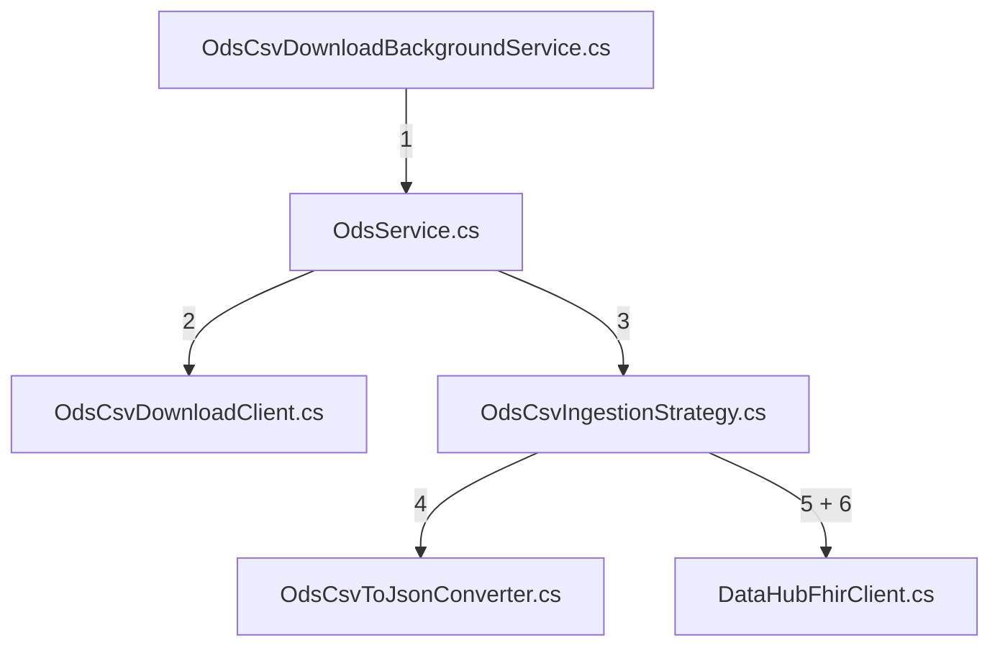

# Source Integration Setup

## Deciding between Push or Pull integration

Healthcare Data Exchange integrates with multiple consumers and providers, as described in
the [Architecture page](../design/architecture.md). The data from the providers can be either pushed to the platform or
pulled from the sources. This data can be in multiple formats.

The decision to use a push or pull strategy depends on whether the data providers are capable of actively pushing data
to the platform. If push is not possible, the data needs to be pulled from the sources.

### Pull

Data is ingested into the platform by pulling from the sources. This can be done for example by reading a message from a
MESH mailbox or with RESTful API calls.

### Push

Data is pushed to the platform by accepting REST HTTP requests in FHIR or HL7 formats, or streaming CSV files in the
request body. You can add support for other formats as described in the [Adding a new template](#adding-a-new-template)
section. This strategy is useful when the data providers are capable of actively pushing data. In case a source is not
able to push files in HTTP requests, an 'agent' application might be deployed on the client side, that will push the
data to the platform.

### Data Normalization

Regardless of the data ingestion method, for the data to be stored in the FHIR DB and be queryable by consumers, the
data needs to be normalized into a unified FHIR format. This process is further explained in
the [Adding a new template](#adding-a-new-template) section.

### Authentication and Authorization

Data providers need to be authenticated and authorized to interact with the platform. The platform uses Azure Entra for
authentication and authorization.

When data providers are pushing data to the platform, they need to be authenticated and authorized against our system.
They need to be registered in Entra and have the role of data provider to be able to push data.

When the platform is pulling data from the data providers, our system needs to be authenticated and authorized against
their system.

Further detail is provided in the [Authentication and Authorization](link) section (TO DO - Frances).

## Deciding on data persistence

The second decision to make is whether the data needs to be persisted in the FHIR DB. If the data needs to be persisted
in the FHIR DB, the data needs to go through conversions and mappings to
be [transformed into a unified FHIR format](#adding-a-new-template). If the data has to be persisted in the original
format, the data can be stored in [Azure Blob Storage](https://azure.microsoft.com/en-gb/products/storage/blobs). You
will also need to decide on the retention period for the data.

## Adding a new template

The following instructions apply if you decided to persist the data in the FHIR DB and need to convert it to FHIR
format.
For more information about templates and data mapping [see here](../data-mapping/overview.md)

### Adding a converter (if the source is CSV)

If the source data is in CSV format, you will need to create a custom converter from CSV to JSON: `src/Core/Converters`.
You can use the existing converters as a reference, for example `src/Core/Converters/PdsMeshCsvToJsonConverter.cs`.

### Adding a Liquid template

Once you have converted the source data to JSON or if the source data is in another format (rather than CSV), you will
need to create a Liquid template to convert the source data to FHIR.

In order to integrate a new source system, you need to create a new template. The template defines how source data
should be converted into FHIR. The templates are written in [Liquid](https://shopify.github.io/liquid/) templating
language and make use
of [custom filters](https://github.com/microsoft/FHIR-Converter/blob/main/docs/Filters-and-Tags.md).

The liquid templates are stored in the `./templates` directory of the repository. To add a new template, create a folder
within the directory with the name of the source system (organisation code e.g. rbd). Within this folder, create folders
representing each source domain (e.g. emergency-care) and within each source domain, further subdivide the templates
into folders representing the source data type (e.g. hl7v2).

### Adding tests for the new template

The tests for the templates are stored in the `./tests` directory of the repository. To add further tests, create a new
folder structure (corresponding to the structure within the `./templates` directory) within the `Templates.Tests/input`
directory, and add some examples of source data. Add corresponding folders into the `Templates.Tests/output` directory
which will contain the files with expected FHIR output in .json format after the conversion is complete. See the
examples in the `./tests/Templates.Tests` directory for further guidance.

### Pushing the new template to Azure Container Registry

In order for data conversion operations to execute, you need to build a docker container containing the templates, and
push it to Azure Container Registry. A docker image is supplied which performs this task.

First, set the tag which will be applied to the container in the `.env` file, within the `./docker` directory.
You also need to update your local `appsettings.json` file (found within the root folder) with the tag value before
running the solution, and running the tests.

Next build the container with the following command:

`docker-compose -f docker/docker-compose.yml build templates-pusher`

And finally run the container with the following command, which will push the container to the ACR:

`docker-compose -f docker/docker-compose.yml run templates-pusher`

> :information_source: You need to rebuild and rerun the container if any changes are made to the templates.

## Create a new integration and connect it to the current code

Our integrations are separated into two main parts - Infrastructure and Core.
The infrastructure part is responsible for importing the data from the source, and the core part is responsible for
orchestrating the data flow, converting the data to the FHIR format, and persisting it.

Each Integration has 3 main parts:

1. API - responsible for invoking or exposing the integration. Exposed operations names are prefixed with the $
   character,
   to denote RPC-like additions as per [the FHIR spec](https://www.hl7.org/fhir/http.html#styleguide).
1. Infrastructure - responsible for importing the data from the source.
1. Core - responsible for orchestrating the data flow, converting the data to the FHIR format, and persisting it.

> Note: The separation and design of the integrations code is based on
> the [common web application architectures - clean architecture design](https://learn.microsoft.com/en-us/dotnet/architecture/modern-web-apps-azure/common-web-application-architectures#clean-architecture).

### Example

We can see the ODS integration as an example. The ODS integration is importing NHS organisations data from different
regions across the UK.
Each region has its own CSV file, and the data is pulled into the platform using a scheduler.

1. The first step is defining the type of the integration. In this case, the integration is a pull integration.
   The data is pulled from the source using a scheduler. The scheduler is in the `src/Api` folder and triggers the
   entire process.
   `OdsCsvDownloadBackgroundService.cs`
   is the background service that is responsible for invoking the ingestion, which is implemented in
   the `OdsService.cs`.

1. Next we need an orchestrator. This will be responsible for orchestrating the data flow. The orchestration logic can
   be found in
   the `OdsService.cs`
   file.
   This file is responsible for:
    1. Pulling the data from the source.
    1. Converting the data.
    1. Saving the data.

1. To import data from a new source, an integration should be created in the `src/Infrastructure/<INTEGRATION_NAME>`
   folder.
   We will start by looking at the infrastructure and data import.
   The ODS Infrastructure folder is separated into 2 folders:
    1. `Clients` - This folder contains the clients that are responsible for pulling the data from the source.
    1. `Configuration` - This folder contains the classes for binding the integration's configuration.

1. Finally, we would like to have a way to convert and save the data into the FHIR Service. In
   the `src/Core/<INTEGRATION_NAME>` folder, we will have the strategy and converters for the integration.
   For ODS Integration, we have
   the `OdsCsvIngestionStrategy.cs`
   file. This is responsible for converting the CSV data to JSON and sending the data to the FHIR Service. This is
   separated into 2 parts:
    1. `Converters` - This folder contains the strategies for converting the
       data. `OdsCsvToJsonConverter.cs`
       is the converter that is responsible for converting the CSV data to JSON.
    1. `DataHubFhirClient.cs` -
       This is the client used to communicate with the Data Hub FHIR server and is performing two actions:
        1. Converting the data using the Liquid templates and the $convert-data endpoint from JSON to FHIR.
        1. Saving the data into the FHIR server.

Once you have created the integration, you need to connect it to the current code and register the created services.
For both Core and Infrastructure, you need to add a DependencyInjection file in `src/Core/<INTEGRATION_NAME>`
and `src/Infrastructure/<INTEGRATION_NAME>` respectively.
As an example, see `ODS Core DependencyInjection.cs` and `ODS Infrastructure DependencyInjection.cs` files.

Don't forget to add tests to the tests folders for the new integration.

> Note: You can also see the rest of the integrations (Ndop, Pds and DataHub) in the respective folders are built in the
> same way.

## Defining configuration for a new integration

TBD (currently we do not have a unified configuration file for the integrations, but this will be added in the future)
