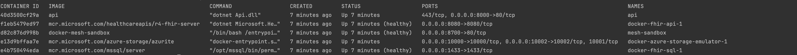

# Getting Started

## Project Structure

This project is structured into several parts:

- `src`: This is where the main application code resides. It's a .NET 8.0 application.
- `tests`: This is where the tests reside.
- `templates`: This directory contains the liquid templates which are used during the FHIR mapping and conversion operations.
- `docker`: This directory contains the Docker Compose file used to run the application locally, along with its dependencies and mounted storage volume(s).
- `docs`: Contains the project documentation, which can be built into a static site using MkDocs, and supplied configuration and docker-compose file.
- `data`: contains sample and test data.

## Local Development

See below for details to get up and running.

Further information for developers wanting to work on the project can be found [in the developer getting started guide](./developer/development-guide.md).

### Prerequisites

- [Docker](https://docs.docker.com/get-docker/)
- [.NET SDK 8](https://dotnet.microsoft.com/en-us/download/dotnet/8.0)
- IDE of choice

### Running the API and its dependencies

The docker-compose file located under the 'docker' folder will build and run
a containerized version of the application, along its dependencies such as the [OSS FHIR server](https://github.com/microsoft/fhir-server) and the SQL Server database for the FHIR server, as well as an [Azurite Azure Storage Emulator](https://learn.microsoft.com/en-us/azure/storage/common/storage-use-azurite?tabs=visual-studio%2Cblob-storage) container for local emulation of Azure Blob Storage. See more information on the [Azure Storage Emulator](#storage-emulation).

#### Prerequisite: Set environment variables

Copy the contents of the `docker/.env.template` file to a new `.env` file:

```bash
cp docker/.env.template docker/.env
```

Fill in the missing fields:

- AZURE_CLIENT_ID
- AZURE_CLIENT_SECRET
- AZURE_TENANT_ID
- AZURE_STORAGE_CONNECTION_STRING
- SAPASSWORD - Please make sure to comply with the [SQL Server password policy](https://dev.mysql.com/doc/refman/8.3/en/validate-password.html#:~:text=Passwords%20must%20be%20at%20least,1%20special%20(nonalphanumeric)%20character.)
- TAG
- DataHubFhirServer__TemplateImage - Update the value to the image name of the templates image in your Azure Container Registry

#### Option 1: Running the application using the all-in-one script

To run all the required services using a script, run the following command from the root of the repository:

```bash
bash ./docker/start-clean.sh
```

If you'd rather run the services individually or find out more about what the script does under the hood, you can follow the steps below. For more information on the components, see also the [developer/development-guide.md](./developer/development-guide.md).

#### Option 2: Running each service individually

For the API to work properly with the templates, you will need to have the templates image in your Azure Container Registry. You can build the image using the Dockerfile in the templates folder and push it to your Azure Container Registry. This is described in [Liquid Templates section of the development guide](./developer/development-guide.md/#liquid-templates).

You will also need to run the data initialization - also described in the [Data Initialisation section of the development guide](./developer/development-guide.md/#data-initialisation).

Once those two services are running, run the following command from the root of the repository:

```bash
docker-compose -f docker/docker-compose.yml up
```

You can also run individual containers by specifying the service name,
for example to run the FHIR server (and the SQL Server database it depends on):

```bash
docker-compose -f docker/docker-compose.yml up fhir-server
```

> **Note:** When running on Apple Silicon, you need to set the following environment variable on the `fhir-api` services: `DOTNET_EnableWriteXorExecute=0`.

#### Option 3: Running the Application Using the .NET SDK

To run the application using the .NET CLI, run the following commands from the root of the repository:

```bash
cd src/Api
dotnet run
```

Alternatively, you can run and debug the application from your IDE of choice for faster development iterations.
All services defined in the docker-compose have container-to-host port mappings defined, so the application can be run directly and it will still have access to any relevant dependencies.

### Test the Setup

Once the application is running, check if you have the following services running:



You can test the setup by navigating to the following URLs:
[http://localhost:8000/Patient?family=Smith&gender=female&birthdate=2010-10-22](http://localhost:8000/Patient?family=Smith&gender=female&birthdate=2010-10-22).
You should see a FHIR resource of type Patient with id 9000000009 in JSON format.

### Running the tests

To run the tests, you can use the following command:

```bash
cd tests
dotnet test
```

### Storage Emulation

This project uses the [Azurite](https://learn.microsoft.com/en-us/azure/storage/common/storage-use-azurite) emulator for local Azure Storage development. This is configured a service in the `docker-compose.yml` file. To connect to the emulator, a "fake" connection string is used.

`DefaultEndpointsProtocol=http;AccountName=devstoreaccount1;AccountKey=Eby8vdM02xNOcqFlqUwJPLlmEtlCDXJ1OUzFT50uSRZ6IFsuFq2UVErCz4I6tq/K1SZFPTOtr/KBHBeksoGMGw==;BlobEndpoint=http://127.0.0.1:10000/devstoreaccount1;QueueEndpoint=http://127.0.0.1:10001/devstoreaccount1;TableEndpoint=http://127.0.0.1:10002/devstoreaccount1;`

> **Note:** While this connection string includes an `AccountKey`, it is not deemed a "secret". It is an artificial connection string used by the storage emulator only. Details are documented [here](https://learn.microsoft.com/en-us/azure/storage/common/storage-use-azurite#http-connection-strings).
