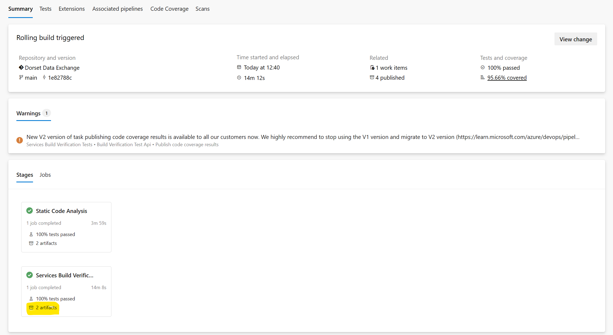
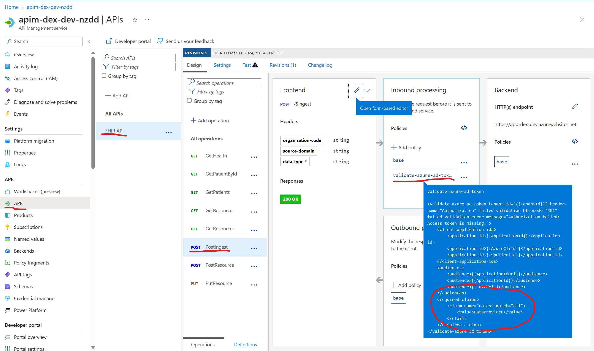

# Overview

Our resources for DEX are described using [Terraform](https://developer.hashicorp.com/terraform/docs), which is an infrastructure-as-code tool. This means that we can specify what the desired state of our system is, and Terraform will figure out how to create that state.

This overview goes over some of the key concepts and files for understanding how the infrastructure is deployed. In particular, the following contents will provide an in-depth explanation of how the end-to-end process for our deployment works.

We'll cover:

1. How our API uses `tags` to add metadata to endpoints and routes.
1. How our CI pipeline generates a Swagger file, which contains our Open-API specifications.
1. How that same Swagger file is referenced to deploy our Azure API Management service.
1. How the `tags` we defined are used to create policies in Azure API Management.

## Contents

1. [The entry point - main.tf](#maintf)
1. [Where variables are declared - variables.tf](#variablestf)
1. [Where variable values are provided - .tfvars](#tfvars)
1. [A top-level resource - app-registration.tf](#app-registrationtf)
1. [Working with variables and values](#working-with-variables-and-values)
1. [Dynamic creation of APIM policies using Terraform](#dynamic-creation-of-apim-policies-using-terraform)
1. [Putting it all together](#putting-it-all-together)

## main.tf

This is the primary entry point for our Terraform configuration. It is where we define the providers we use and Terraform modules we want to include in our deployment. For example, since we're creating our infrastructure on Azure, we use the `azurerm` provider. See docs [Azure Provider](https://registry.terraform.io/providers/hashicorp/azurerm/latest/docs).

In addition, we also define different modules, these are self-contained packages of Terraform configurations that are managed as a group. This is done to improve modularity and maintainability by breaking configurations into smaller modular constructs.

In our `main.tf` file, we reference a module for setting up a network, one for setting up our health services, and another for more general services we use. These are referenced from a subfolder for each. Note that, these modules can also have their own respective `main.tf` file, which differs to `main.tf` in the root.

Each module consists of the variables that it needs. It is from the `main.tf` file that we specify a value for each of those variables. Consider this code snippet, and the different ways of assigning a variable a value:

```tf
resource "azurerm_resource_group" "rg" {
  location = var.location
  name     = "rg-dex-${var.env}"
}

module "network" {
  source                              = "./network"
  location                            = var.location
  resource_group_name                 = azurerm_resource_group.rg.name
}
```

- The `source` argument is defined using a string.
- The `resource_group_name` variable is defined by referencing a resource we have already defined in the same module. That particular resource is the type "azurerm_resource_group" (see Terraform [docs](https://registry.terraform.io/providers/hashicorp/azurerm/latest/docs/resources/resource_group)), which we have given the name "rg". That resource has `location` and `name` variables, so we can access the desired variable by referencing the resource type, resource name, and resource variable as `azurerm_resource_group.rg.name`.

## variables.tf

The variables declared in this file can be used across multiple Terraform files within the same module. They are typically used to customize aspects of the resources being created, such as their names, locations, sizes, and so on.

Here's an example of what a variable declaration looks like in the `variables.tf` file:

```tf
variable "location" {
  type = string
}
```

In this example, a variable named `location` is declared and it's of type `string`.

## `.tfvars`

- A `.tfvars` file (or Terraform Variables file) is used to set the values of the variables declared in our `variables.tf` file. The `.tfvars` file is a simple key-value store where the keys correspond to our variable names.

For example in `tfvars.template`, we have the line:

```tf
location = "UK South"
```

For full instructions on how to use the `tfvars.template` see the `infrastructure/README.md`, which will give you instructions on how to use the `tfvars` for local development.

A continuous integration (CI) and continuous deployment (CD) pipeline runs on each PR merge.

More specifically, the CD pipeline is responsible for deployment, and the definition of the pipeline can be found in `.pipelines/cd-pipeline.yaml`. The stage "DeployInfrastructure" in the yaml file references the `.pipelines/templates/deploy-infrastructure.yaml` file.

It is in this file where the values for the terraform variables are configured. Firstly, we login using the service principal, and add the build agent IP to keyvault so that the pipeline is able to access the necessary secrets.

Next, a script is run which writes the values for each variable to a `tfvars` file for the given environment. This pulls values from the associated variables group in Azure DevOps. This means that values for variables can be kept in a single place and securely accessed.

## app-registration.tf

Also in the top-level is the Terraform file for deploying the Application Registration which can be managed via [Microsoft Entra ID](https://learn.microsoft.com/en-us/entra/fundamentals/whatis). The documentation for the `azuread_application` resource can be found [here](https://registry.terraform.io/providers/hashicorp/azuread/latest/docs/resources/application).

Some important things to note are:

- The application is deployed and we specify its identifier uri.
- The identifier uri must be globally unique, so we append a random string onto the URI.
- The random string is generated using a function at the top of the file.

When creating it, ensure that a group of owners is assigned. This step is crucial because adding more owners (and consequently granting permissions) becomes challenging unless at least one owner is initially assigned. The `app_registration_owners` is set in the pipeline variables group, and should include the IDs of the users who should be assigned ownership.

The resource includes the scope "API.Call" which can be granted to a user or application that has permissions to call the API.

It also includes the App Roles that the application is created with, such as `DataProvider` and `DataConsumer`, which can be assigned to users or applications. This allows us to control which endpoints they can call, given their role.

To add a new App Role, define which members can be assigned the role (User or Application), description and name, and a unique id, as shown below:

```tf
  app_role {
    allowed_member_types = ["User", "Application"]
    description          = "DataAdministrator has full admin permissions"
    display_name         = "DataAdministrator"
    enabled              = true
    id                   = "386395d3-901z-3156-ae07-34z0ba037z90"
    value                = "DataAdministrator"
  }
```

Finally there is a pre-authorised application resource, the Azure CLI, which means that developers can use the Azure CLI to request an access token for the application registration.

```tf
resource "azuread_application_pre_authorized" "azcli" {
  application_id       = azuread_application.app.id
  authorized_client_id = var.azure_cli_client_id

  permission_ids = flatten([
    for api in azuread_application.app.api : [
      for scope in api.oauth2_permission_scope : scope.id
    ]
  ])
}
```

The app registration terraform file is in the top-level because we need to use the output in some of the follow-on modules. For example, in order to be able to create the policies in Azure API Management, we need to know the value of the application registration URI. We can only know the application registration URI *after* the application registration resource has been created, because of the requirement for a globally unique URI with a random guid.

## Working with variables and values

In Terraform, it's common to have multiple `variables.tf` files when you're working with modules. Each module in Terraform is a self-contained package of Terraform configurations that manages a collection of related resources, and each of these modules can have its own `variables.tf` file.

The `variables.tf` file in each module is used to define the variables that are used in the module. This allows the module to accept inputs from the parent configuration or other modules.

Here's an example of a directory structure with multiple modules, each having its own `variables.tf`:

```md
main.tf
variables.tf
network/
  - main.tf
  - variables.tf
services/
  - main.tf
  - variables.tf
  - api_management/
    - main.tf
    - variables.tf
    - api_management_dex.tf
```

## Example: Passing the App Reg URI between modules

Using the example of the Application Registration resource, which is created at the top-most level, we'll see how the URI of that resource can be passed to other modules.

First, if you open `main.tf`, you'll see that here the "services" module is declared, and values for the required variables are assigned. Here is a snippet, but the `app_registration_uri` is assigned the value of the app reg's `identifier_uri` (note: it's possible to assign multiple URIs, hence we take the first in the list):

```tf
module "services" {
  app_registration_id              = azuread_application.app.client_id
  app_registration_uri             = tolist(azuread_application.app.identifier_uris)[0]
}
```

Next, the "services" module has a `main.tf` file, which in it includes the declaration for the Azure API Management module called "api_management". Here, in the same way, the app_registration_uri (which is now part of `variables.tf` within "services") can be accessed and assigned to the "api_management" module.

```tf
module "api_management" {
  source                           = "./api_management"
  app_registration_id              = var.app_registration_id
  app_registration_uri             = var.app_registration_uri
}
```

Then, within the "api_management" module, there is the file `api_management_dex.tf`, which defines the different APIM resources required for DEX. It is in this resource, which uses the `app_registration_uri` variable (which has been passed to it from the parent, "services"):

```tf
resource "azurerm_api_management_named_value" "dex_app_id_uri" {
  name                = "ApplicationIdUri"
  api_management_name = azurerm_api_management.apim.name
  resource_group_name = var.resource_group_name
  display_name        = "ApplicationIdUri"
  value               = var.app_registration_uri
}
```

Finally, that named value gets used in `policies/dex_operation_policy.tftpl`, e.g. we are able to inject the `ApplicationIdUri` like so:

```xml
<audience>{{ApplicationIdUri}}</audience>
```

## Dynamic creation of APIM policies using Terraform

Azure API Management (APIM) policies are a powerful capability of the APIM service that allow the behaviour of the API operation to be modified without changing the code of the API itself. Policies are a series of statements that are executed sequentially on the request and/or response, and in DEX we use it for authentication and authorization - to check whether the user or application sending that request has permissions to access the endpoint. APIM policies are written in XML format.

One downside of XML is that it is difficult to maintain and debug. This is relevant to our project as we have several endpoints, each with different policy requirements. Whilst some portions of the policy are similar, it would be difficult to maintain multiple XML files.

Instead, we can use a [Terraform Template file](https://developer.hashicorp.com/terraform/language/functions/templatefile) which has the extension `.tftpl`. A `.tftpl` file allows you to use interpolation syntax to embed variables or expressions that will be evaluated when the template is used in a Terraform configuration.

In the "api_management" module, in the `locals.tf` file, you can see where the `dex_operation_policy` gets populated. What happens here is the `templatefile` function is used to render a template file with the provided variables (in this case, tags relating to the endpoint). This is done for each endpoint, so each endpoint has its own (custom) policy, which is determined by the tags.

```tf
locals {
  apim_name      = "apim-dex-${var.env}-${var.random_id}"
  apim_sku       = var.env == "prd" || var.env == "stg" ? "Premium" : "Developer"
  apim_sku_name  = "${local.apim_sku}_${var.apim_instance_count}"
  apim_dns_label = lower(replace(local.apim_name, "-", ""))
  public_ip_name = "apim-ip-dex-${var.env}-${var.random_id}"

  open_api_specification = jsondecode(file("${path.module}/dex-swagger.json"))

  operations = flatten([
    for endpoint in local.open_api_specification.paths : [
      for endpointType in endpoint : {
        operationId = endpointType.operationId
        policy = templatefile("${path.module}/policies/dex_operation_policy.tftpl", {
          tags = endpointType.tags
        })
      }
    ]
  ])
}
```

## How are tags used in the APIM policy

Let's see how the tags are used, and then return to where they come from.

In the `dex_operation_policy.tftpl` file observe these two key areas.

The first, we can see that if the provided "tags" variable contains the tag "FhirBackend", then it will inject a specific piece of XML.

```xml
        %{~ if contains(tags, "FhirBackend") ~}
        <set-backend-service backend-id="fhir-server" />
        %{~ endif ~}
```

Secondly, if a particular endpoint has a `RequiredRole=DexProvider` tag for example, then this snippet of code will read the tags, check if any of the tags contains the string "RequiredRole". If so, then for each of the tags, it will check if it is a "RequiredRole" tag, and then extract the role using the substring function:

```xml
            %{~ if strcontains((join(";", tags)), "RequiredRole")~}
            <required-claims>
                <claim name="roles" match="all">
                %{~ for tag in tags ~}
                    %{~ if strcontains(tag, "RequiredRole=") ~}
                    <value>${substr(tag, 13, length(tag) - 1)}</value>
                    %{~ endif ~}
                %{~ endfor ~}
                </claim>
            </required-claims>
            %{~ endif ~}
```

E.g. when applied to `RequiredRole=DexProvider`, the following code would extract `DexProvider`.

```xml
{substr(tag, 13, length(tag) - 1)}
```

After the template is used, the XML would be for example:

```xml
            <required-claims>
                <claim name="roles" match="all">
                    <value>DexProvider</value>
                </claim>
            </required-claims>
```

## Adding tags to an endpoint

When we define an API endpoint, we can assign it tags.
In `src/Api/Modules/IngestModule.cs` we define a route for handling HTTP POST requests to the `$ingest` endpoint.

- The first argument to the "MapPost" method is "$ingest", which represents the URL path for the route. In this case, the route will be triggered when a POST request is made to the "/$ingest" endpoint.
- The second argument is a method called "Ingest", which is the handler for the route. This method will be executed when the route is triggered.
- When you use the "WithName" method to assign a name to an operation, that name becomes the operation ID (here, "PostIngest"). The OperationId ensures that the right policies are applied to the right API operations during deployment.
- The "WithTag" method assigns tags, which in our case is where we specify the required role a user or application would need in order to make a POST request to this endpoint.

```cs
    public override void AddRoutes(IEndpointRouteBuilder app)
    {
        app.MapPost("$ingest", Ingest).WithName("PostIngest").WithTags("RequiredRole=DataProvider");
    }
```

Another example of this might be, if adding additional roles:

```cs
    public override void AddRoutes(IEndpointRouteBuilder app)
    {
        app.MapPost("$ingest", Ingest).WithName("PostIngest").WithTags("RequiredRole=DataProvider","RequiredRole=DataAdministrator");
    }
```

As explained in [swagger-file.md](../developer/swagger-file.md), as part of API Management we have a Swagger file which describes the API. The file is not stored in the repository and is instead generated when the CI pipeline is built.

If you have access, you can view the latest swagger file:

1. Go to Pipelines
1. Click **CI Pipeline**
1. Select the latest job run (or whichever you're interested in)
1. Here you will find a "Stages" section, which contains a **Services Build Verification** stage, which should have 2 artifacts, click on "2 artifacts":

  

1. This will list the published artifacts and you should see **SwaggerDoc**. Clicking on this will download the swagger.json file that was generated as part of the CI build.

An example is shown below, specifically, we show the part which relates to the `$ingest` endpoint:

```json
"/$ingest": {
      "post": {
        "tags": [
          "RequiredRole=DataProvider"
        ],
        "operationId": "PostIngest",
```

Our route has been created to support "POST" requests to the `$ingest` endpoint, and has the tags we added.

## Putting it all together

To summarise:

1. In our API, we added the "RequiredRole=DataProvider" tag to a particular endpoint and route.
1. When the CI pipeline is run, this generates a `swagger.json` file which contains our Open-API specifications.
1. When the API Management service is created via terraform, it references the Open-API specifications from `swagger.json` to create the API routes.
1. Also via terraform, the API Management policies are created, which are policies applied to each endpoint. These use the "tags" in the Swagger file to generate the correct policy definition, using the `dex_policy_operation.tftpl" Terraform template.
1. If we go to the Azure Portal, and look at our deployed Azure API Management service, by selecting "APIs" > "FHIR API" > "PostIngest" > "Policies", we can see how the Terraform template has been populated with values for the tags from the Swagger file:


