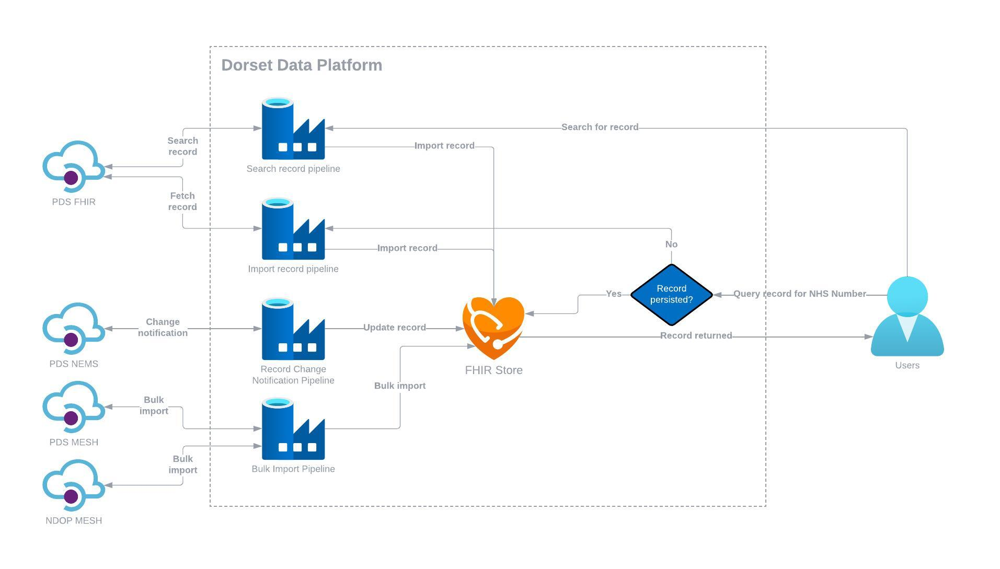

# Personal Demographics Service

The data exchange will integrate with the PDS APIs to import patients and keep their information up to date.

## Design

This diagram shows the intended architecture for integration with the PDS APIs, including the persistence of PDS data and how the persisted data will be refreshed.

## APIs

See the following links for details about the APIs:

* PDS FHIR API - <https://digital.nhs.uk/developer/api-catalogue/personal-demographics-service-fhir>
* PDS MESH API - <https://digital.nhs.uk/developer/api-catalogue/personal-demographic-service-mesh>
* PDS NEMS API - <https://digital.nhs.uk/developer/api-catalogue/personal-demographics-service-notifications-fhir>

## Test Data

PDS test data is generated in the NHSD Test Data Self Service Portal. The portal will generate a number of test patients and import them
into the specified PDS test environments. The patients can then be downloaded from the portal in Excel format.

The test data generated for this project can be found in the test data folder.

## Test Data Self Service Portal

The portal can be accessed at the following URL:

<http://testdatacloud.co.uk:8080/ords/apex-prod/f?p=159:LOGIN>

The username/password are stored in the development key vault.

## PDS MESH

The PDS MESH API is used for refreshing the Patient resources persisted in the system as a batch process, executed on a regular schedule.

The interactions with the API involve uploading a request to the outbox of the MESH mailbox linked to the PDS MESH workflow, and
polling the inbox to check for a response. Once a response is available, it is downloaded and processed by the application.

### Request

The request consists of a single CSV which contains the patients that we require updated details for. It must contain the fields specified
by the PDS MESH workflow. Details of the format of the request file can be seen here:

<https://digital.nhs.uk/developer/api-catalogue/personal-demographic-service-mesh/pds-mesh-data-dictionary#request-file-format>

### Response

The response consists of a single CSV file containing the latest information for each patient included in the request file. Details of the format of the response file can be seen here:

<https://digital.nhs.uk/developer/api-catalogue/personal-demographic-service-mesh/pds-mesh-data-dictionary#response-file>

In addition, the response file will include a code to indicate whether a record match was found. A table with the response codes (including at a person level) can be found here:

<https://digital.nhs.uk/developer/api-catalogue/personal-demographic-service-mesh/pds-mesh-data-dictionary#response-codes>

#### Handling invalid records

The PDS MESH person level response codes include an invalid flag.

The invalid flag may be used when an NHS number is being deleted/discontinued. This could be for legal or safeguarding reasons, for example adoption, gender reassignment, other protected person such as witness protection or where there are possible data quality issues that have been dealt with.

In the case of duplicates, records are merged, one number is retained, and the other is superseded.  PDS retains a systemic link between the two and if someone traces a patient using the superseded number, the PDS record for the retained number will be returned.

Retrieving and accessing a record with an invalid flag means:

* a discontinued NHS number has been used or a record is no longer in use, (for example where two patient records have been merged and one is no longer used) in which case the NHS number that should be used will be returned
* the healthcare professional will not be able to see any demographic information for the patient and a message will be displayed indicating the record is not valid and that they should search for the correct demographic record, the searcher gets a ‘No trace’ response

Source: <https://www.england.nhs.uk/long-read/personal-demographic-service-pds/>

In DEX, we handle merging and deleting records to reflect the demographics from PDS. This is done based on the following:

* When tracing is successful and a match is found, but the record has a confidentiality status of ‘I’ (invalid), certain patient details are suppressed.
* Specifically, all information related to the patient, including the NHS number, is hidden.
* The resulting response for such invalid records appears as follows:

`02403456-031f-11e7-a926-080027a2de00,9991112758,,,,,,,,,,,,,,,,91,0000000000,1,0,0,0,0,0,`

* The field that needs to be checked for matching indicators is the one containing the NHS number.
* If there is a match with any of the following values, the record has not been successfully matched:
  * `0000000000`: No match was found.
  * `9999999999`: Multiple matches were found.
  * `<blank>`: Not enough fields provided for the trace.

Other fields are left empty or contain default values.

Source: <https://digital.nhs.uk/developer/api-catalogue/personal-demographic-service-mesh/pds-mesh-data-dictionary#response-codes>
