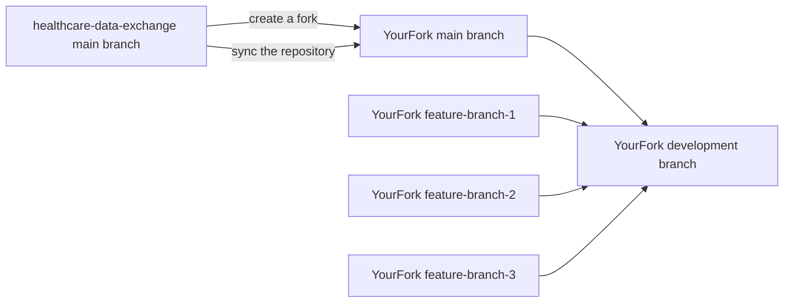

# Setup Guide

This guide will help you set up the repository in your organisation, create a fork, set up deployment pipelines, add Liquid templates for your data-type, and integrate with the Healthcare Data Exchange.

## Create a fork of the repository

You will have to create a fork of this repository for your organisation. Below are the steps to do so depending on whether you use Github or Azure DevOps.

Please note that the below guidance is for deploying the Healthcare Data Exchange in your organisation. If you are looking to contribute to the original repository, please refer to the [contribution guidelines](https://github.com/dorset-ics/healthcare-data-exchange/blob/main/CONTRIBUTING.md).

### Github

1. Navigate to the [Healthcare Data Exchange repository](https://github.com/dorset-ics/healthcare-data-exchange)
1. Click on the `Fork` button on the top right corner of the page.
1. Select your organisation as the destination for the fork. More detailed instructions at the [fork a repo guide](https://docs.github.com/en/get-started/quickstart/fork-a-repo).
1. Once the fork is complete, you will be redirected to your forked repository.
1. Clone the repository to your local machine.
1. Please ensure that you create a separate branch for your changes. We recommend using the `development` branch for your changes (or any branch name of your preference). We use `main` branch only to sync back the changes from the upstream repository.
1. You can now start making changes to the codebase.
1. To keep your fork up to date with the original repository, you can follow the steps at [syncing a fork guide](https://docs.github.com/en/github/collaborating-with-pull-requests/working-with-forks/syncing-a-fork).
1. To contribute back to the original repository, please refer to the [contribution guidelines](https://github.com/dorset-ics/healthcare-data-exchange/blob/main/CONTRIBUTING.md).

### Azure DevOps

1. Navigate to the [Healthcare Data Exchange repository](https://dev.azure.com/dorset-ics/Healthcare%20Data%20Exchange/_git/Healthcare%20Data%20Exchange)
1. Click on the `Fork` button on the top right corner of the page.
1. Select your organisation as the destination for the fork. More detailed instructions are available at [setting a fork in Azure DevOps](https://docs.microsoft.com/en-us/azure/devops/repos/git/forks?view=azure-devops&tabs=browser).
1. Once the fork is complete, you will be redirected to your forked repository in Azure DevOps.
1. Clone the repository to your local machine.
1. Please ensure that you create a separate branch for your changes. We recommend using the `development` branch for your changes (or any branch name of your preference). We use `main` only to sync back the changes from the upstream repository.
1. You can now start making changes to the codebase.
1. To keep your fork up to date with the original repository on Github, you can follow the [guide for syncing fork in Azure DevOps](https://learn.microsoft.com/en-us/azure/devops/repos/git/forks?view=azure-devops).
1. To contribute back to the original repository, please refer to the [contribution guidelines](https://github.com/dorset-ics/healthcare-data-exchange/blob/main/CONTRIBUTING.md).

### Diagram for forking and syncing

## Set up keys and service principals for running pipelines

### Github

TBD

### Azure DevOps

1. The first step in Azure DevOps to run pipeline would be to create a `Azure Service Principal` for your `Azure DevOps pipeline`. Here are the steps to [create the Azure Service Principal](https://learn.microsoft.com/en-us/entra/identity-platform/howto-create-service-principal-portal).
1. The next step would be to create a `Service Connection` in Azure DevOps. This `Service Connection` will be used to authenticate the pipeline execution.
1. The detailed steps are present on the [Azure documentation for managing service connections in Azure DevOps](https://learn.microsoft.com/en-us/azure/devops/pipelines/library/service-endpoints?view=azure-devops&tabs=yaml).

## Set up BVT (build verification testing) pipelines

### Github Actions Pipeline

1. As part of the forked repository, you will get the `.github/workflows` folder in the repository.
1. `bvt.yaml` defines the `bvt` steps. You can modify the steps as per your requirements.
1. The pipeline uses `Azure Container Registry` to store the `liquid templates` against which the `template tests` are run.
1. You can modify `acr_name` as per your configurations.

### Azure DevOps Pipelines

1. As part of the forked repository, you will get the `Pipelines` section in Azure DevOps under the `.pipelines` folder.
1. `templates/bvt.yaml` defines the `bvt` steps. You can modify the steps as per your requirements.
1. The pipeline uses `Azure Container Registry` to store the `liquid templates` against which the `template tests` are run.
1. You can modify `ACR_NAME` as per your configurations.

## Set up CI/CD pipelines

### Github Actions Pipeline

1. Navigate to the `.github/workflows` folder in the repository.
1. Refer to the existing workflows to create a new workflow for your organisation.

### Azure DevOps Pipeline

1. Navigate to the `Pipelines` section in Azure DevOps.
1. Create a new pipeline or reuse existing one, and select the repository you forked. Refer to [Azure DevOps Pipelines](https://docs.microsoft.com/en-us/azure/devops/pipelines/?view=azure-devops) for more information.
1. Save and run the pipeline.

## Integrate with Data Source

You will have to integrate with the source of the data you want to ingest into the Healthcare Data Exchange. A detailed guide is available at [source integration guide](developer/source-integration-setup.md).

## Add Liquid templates for your data-type

Healthcare Data Exchange repository uses [Liquid templates](https://shopify.github.io/liquid/) to transform data from the source system to the FHIR format. You will need to create a Liquid template for your data-type. Please refer to the existing templates in the `templates` folder for existing liquid templates.

## Set up the Integration with Healthcare Data Exchange

Once your repository is setup within your organisation, you can start integrating with the Healthcare Data Exchange. Here is the detailed [integration guide](developer/integration-guide.md) for integrating with the Healthcare Data Exchange.
